# 서울과학기술대학교 학술동아리 Endless Creation 소개 페이지 제작

**URL : https://endless-creation.netlify.app**
## 개발 동기
외부에 학술 동아리 홍보를 하고 신입생을 모집하기 위해 제작하게 되었습니다. 페이지를 통해 효과적으로 홍보가 되었으며 신입생을 성공적으로 모집할 수 있었습니다.

## 주요 기능
Endless Creation이 지향하는 핵심 가치, 활동 내용들, 멤버 소개, 지원하기 등이 주요 기능들입니다. 이후에 유지 보수를 하며 다른 기능들을 추가하는 중에 있습니다.

## 페이지별 설명
### 1. Home
메인 타이틀, 핵심 가치, 동아리의 대한 간단한 소개, FAQ 등이 주 컨텐츠 입니다.

    
    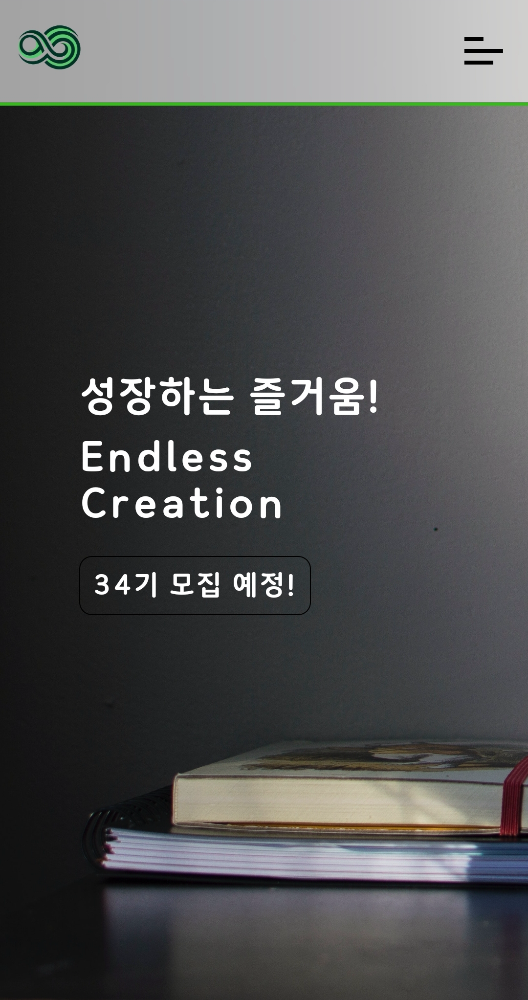 

 

    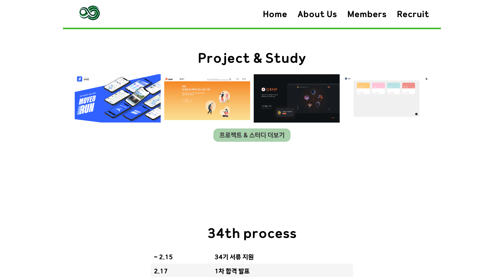
    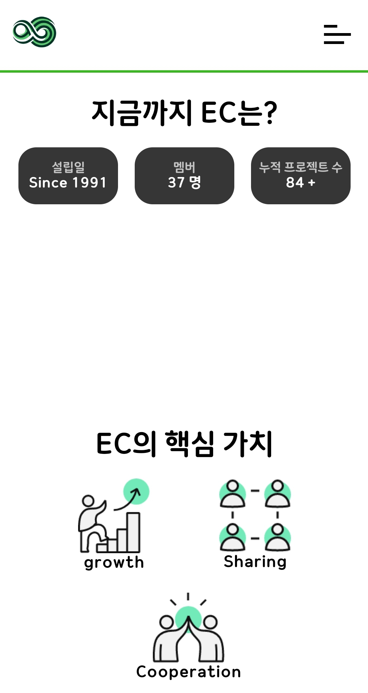  

 

### 2. About us
동아리에 오면 할 수 있는 할동들, 임원진 소개가 주 컨텐츠입니다.

    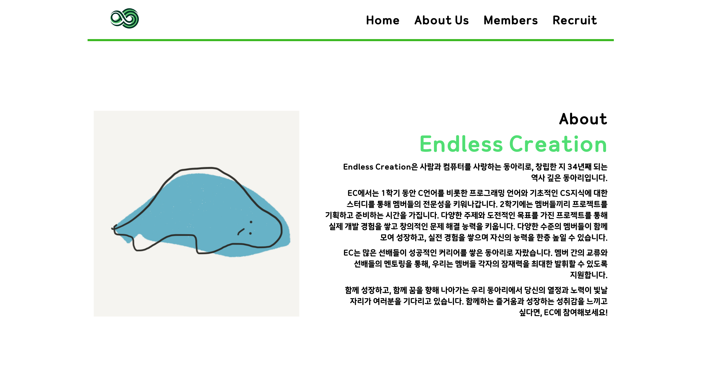
    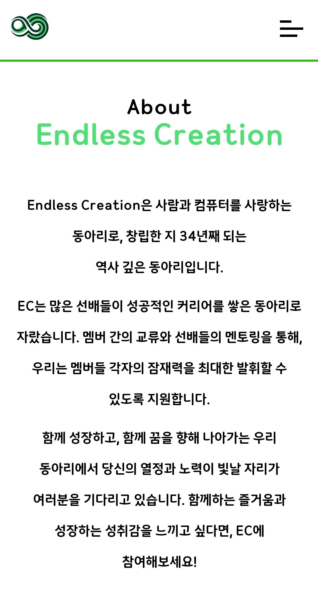
    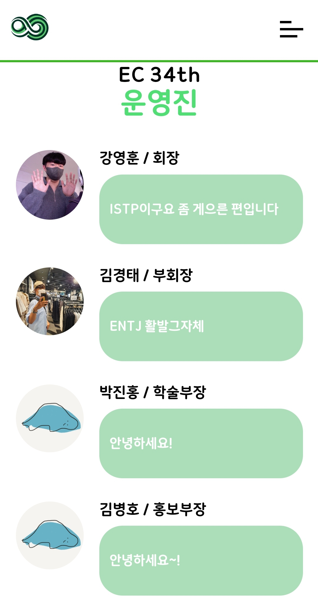  

 

### 3. Members
재학생의 관심 기술, 졸업생들의 커리어가 주 컨텐츠입니다.

    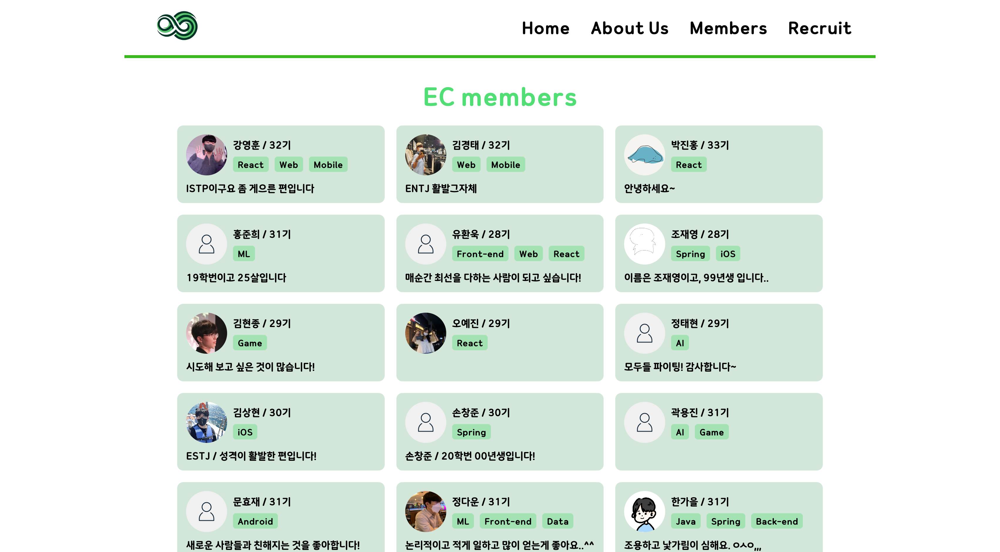
    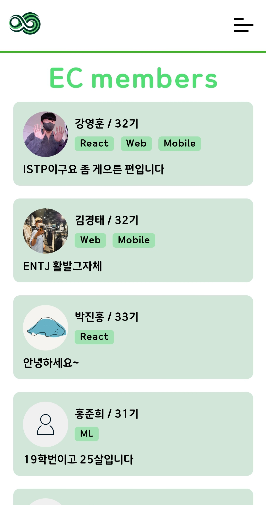  

 

### 4. Recruit
지원하기 버튼을 통해 지원서 양식 페이지로 이동합니다. 지원서 양식 페이지에서는 개인정보 및 몇 가지 질문을 작성하고 formData가 제출됩니다.

    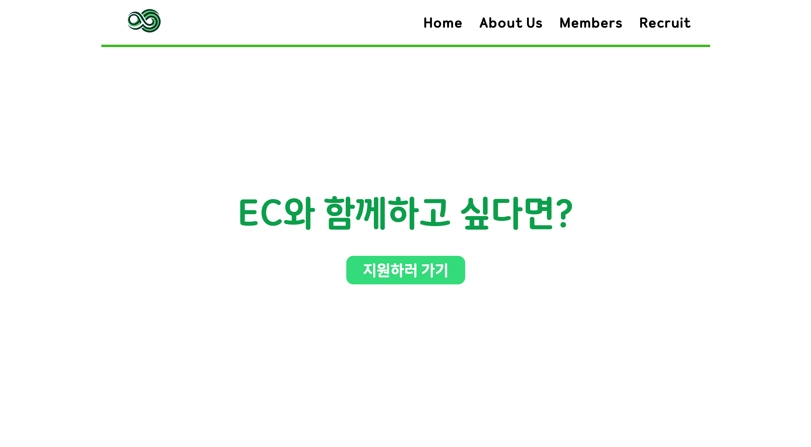
    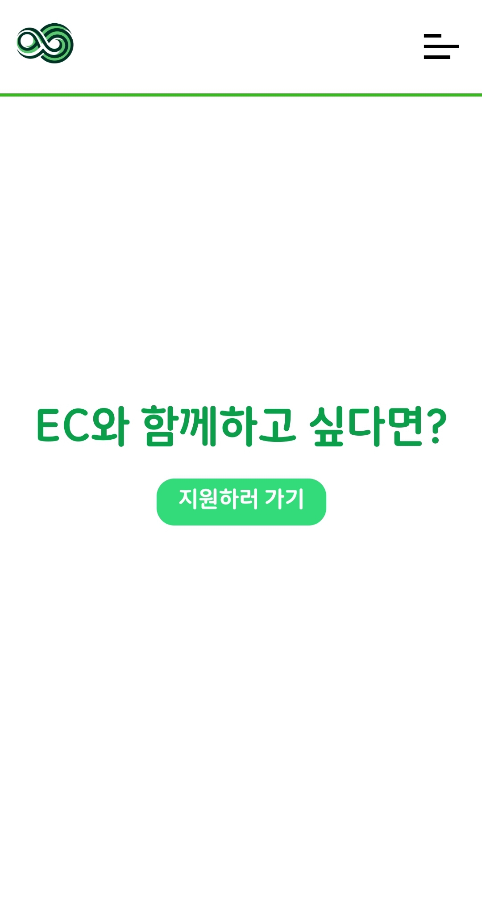
    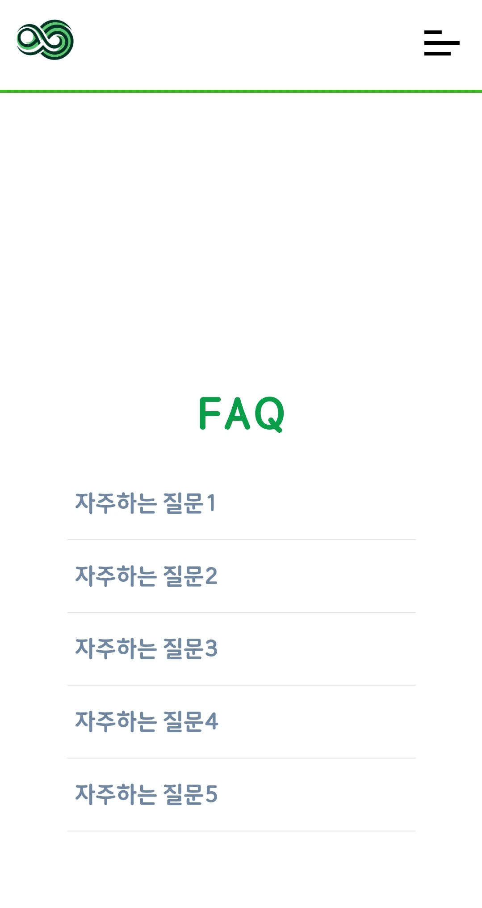

